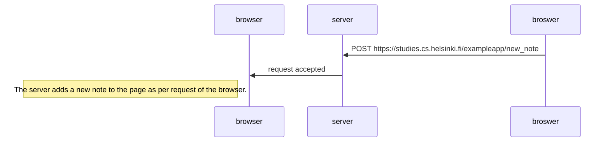

Here is a simple demonstartion of how the request to/from [this webpage](https://studies.cs.helsinki.fi/exampleapp/notes) are sent and what each request triggers in return.

```mermaid
    
    sequenceDiagram
    participant browser
    participant server

    broswer->>server: POST https://studies.cs.helsinki.fi/exampleapp/new_note
    server->>browser: request accepted

    Note left of browser: The server adds a new note to the page as per request of the browser.
```